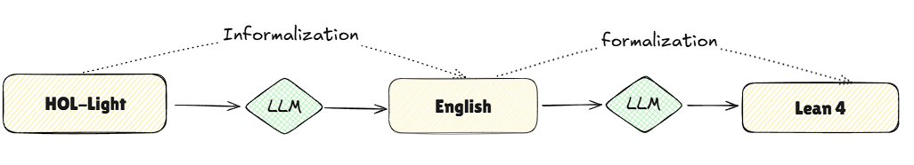
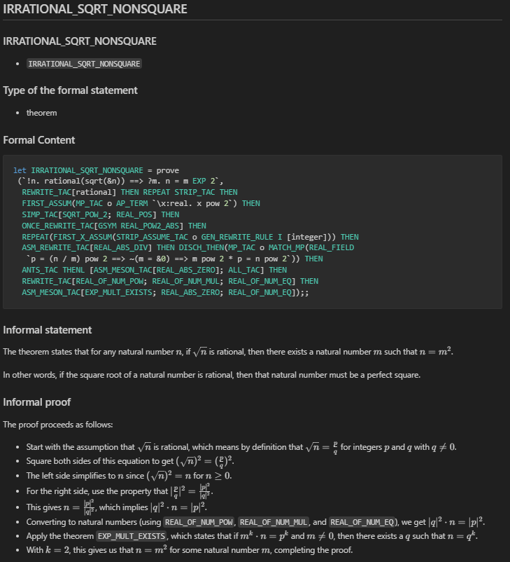

# From HOL-Light to Lean 4

This project aims to proivde a approach to **port the top 100 theorems** from **HOL-Light** to **Lean 4**, focusing on theorems that are formalized in HOL-Light but not yet available in Lean 4.


We have successfully ported the **Quartic formula** (`quartic.ml`) from HOL-Light to Lean 4, with most of the work automated via large language models (LLMs), and only minor refinements required by human intervention.

## Result

#### Informalization
As 29 May 2025, 89 of HOL-Light theorems have all been infromazlied into natural language documentation.

#### Formalization
| File             | Statement Verified | Proof Completed   | Notes                                 |
|------------------|--------------------|-------------------|---------------------------------------|
| `Ceva.lean`      | ✅ Yes              | ❌ No (`sorry`)   | Proof not yet completed               |
| `Desargues.lean` | ✅ Yes              | ❌ No (`sorry`)   | Proof not yet completed               |
| `Feuerbach.lean` | ✅ Yes              | ❌ No (`sorry`)   | Proof not yet completed               |
| `Morley.lean`    | ✅ Yes              | ❌ No (`sorry`)   | Contains some formal proof sketch     |
| `Quartic.lean`   | ✅ Yes              | ✅ Yes            | Fully formalized and verified         |


## 🚀 Workflow

This project consists of two major pipelines:



### 1. HOL-Light → English Markdown (`informalization`)

This pipeline translates formal HOL-Light proofs into **natural language explanations** in Markdown format.

* 📁 Folder: `./informalization/`
* ✅ Completed documents: `./informalization/completed_doc/`

Example of informalization of `sqrt.ml`:



### 2. English Markdown → Lean 4 (`formalization`)

This pipeline takes the informalized Markdown and formalizes it **back into Lean 4**, using LLMs to reconstruct statements and proofs.

* 📁 Folder: `./formalization/`
* ✅ Ported Lean 4 theorems: `./formalization/100/`


## 🛠 Environment

* **Python**: 3.12.9
* **Lean 4 API**: This project uses [`kimina-lean-server`](https://github.com/project-numina/kimina-lean-server) to interact with Lean 4. Setup instructions are available on their GitHub .

* **Python dependencies**: All required Python packages are listed in [`requirements.txt`](./requirements.txt).

### 🔧 Setup Instructions

To install the required Python packages, run:

```bash
pip install -r requirements.txt
```

Make sure to follow the instructions on the Kimina website or GitHub page to configure the Lean 4 server environment.


## 🔄 Extension

Since the intermediate English Markdown serves as a human-readable representation of the formal proofs, it can also be used to **port the theorems to other theorem provers** beyond Lean 4.


