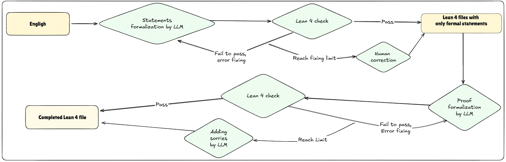

# 🧠 Formalization into Lean 4

This folder contains the pipeline and results for **formalizing Lean 4 code** from the English Markdown generated during the **informalization of 100 HOL-Light theorems**.

Currently, the system supports **LLM inference via the OpenAI API**. Formalization is conducted in two stages: **statements** and **proofs**.

✅ **`Quartic.lean`** is the only file where **both statements and proofs** are fully formalized and **verified in Lean 4**.

## 🔄 Workflow

The pipeline operates in two phases:


### 1. **Formalizing Statements**

* If the model fails to formalize a statement correctly, the process **stops and logs the error**.
* After manually fixing the errors, you can **resume the pipeline** by passing in the corrected statements as a plain `.txt` file.

### 2. **Formalizing Proofs**

* If the proof generation fails, the system inserts a `sorry` placeholder and **moves to the next theorem**.
* The script supports options to **retry and refine** the proof generation a configurable number of times.

> ✅ You can also start from a **Lean 4 sketch file** (containing only the formalized statements) to generate missing proofs using the LLM.


## 🛠 How to Run

1. **Start the Lean server:**
   Before running the script, ensure that `kimina-lean4-prover` is running.

2. **Run the pipeline:**

   ```bash
   bash example.sh
   ```

3. **Refinement parameters:**
   The script allows you to control:

   * the number of retries for fixing sketch errors
   * the number of proof refinement attempts


## 📊 Results

### ✍️ Statement Formalization

* LLMs are able to formalize most theorem **statements correctly**.
* Minor manual corrections may still be necessary (e.g., type issues, typos).

### 🧪 Proof Formalization

* LLMs are able to capture the **overall proof structure**.
* However, significant manual effort is often required to fix type errors, tactic failures, or logical gaps.


## 📁 Output

The `100/` folder contains the current Lean 4 formalizations generated from the English Markdown files in the `informalization/` folder.
These theorems were originally formalized in HOL-Light but **not yet available in Lean 4** (as of May 5th, 2025), according to [Freek Wiedijk's list](https://www.cs.ru.nl/~freek/100/).

Current Lean 4 files include:

* `Ceva.lean`
* `Desargues.lean`
* `Feuerbach.lean`
* `Morley.lean`
* `Quartic.lean`

✅ **`Quartic.lean`** is the only file where **both statements and proofs** are fully formalized and **verified in Lean 4**.

✅ The **statements in all other files** are **verified in Lean 4**, though most proofs are still pending or marked with `sorry`.


