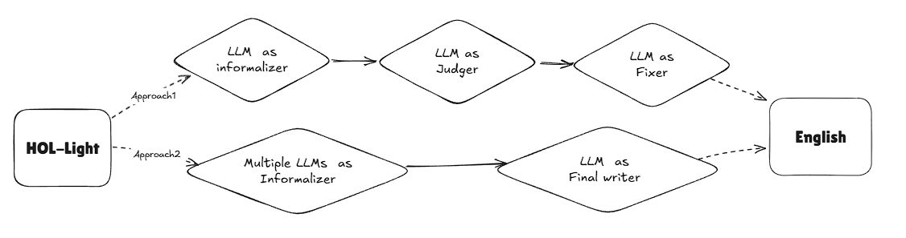

# From HOL-Light to English

The motivation behind this step is that **HOL-Light proofs are often difficult to read** due to their dense and compact syntax. By generating **human-readable English descriptions**, we make these proofs more accessible for both users and downstream formalization pipelines.

This folder contains the code and outputs for **informalizing the top 100 theorems from HOL-Light** into structured English Markdown format.


## 🔄 Workflow

We explored two main approaches for informalization, illustrated in the workflow diagram:



### **Approach 1: Single Informalizer + Judger Evaluation**

* Each LLM prompt (for the informalizer) includes:

  * 📘 **Instruction**
  * 🔗 **Relevant definitions and dependency theorems**
  * 📜 **Formal content (theorem statement and proof)**

* The generated informal explanation is then evaluated by a separate LLM ("judger") based on:

  1. **Syntactic correctness**
  2. **Faithfulness of the informal statement**
  3. **Faithfulness of the informal proof reasoning**

The detailed prompts are in the folder `templates/`

> This process is performed **item-by-item**, meaning each formal theorem or definition is informalized and judged individually.


### **Approach 2: Multi-LLM Informalizers + Merging**

* Based on early experiments, we observed that different LLMs produce **stylistically and semantically diverse outputs**.
* This alternative approach:

  * Uses **multiple LLMs** to generate **parallel informalizations**
  * Then invokes a **third LLM** to **merge or distill** a unified informal version


### **Final Decision**

After extensive testing, we found that **Claude 3.7 Sonnet** was especially effective at understanding and translating formal HOL-Light syntax.
Therefore, we adopted **Approach 1** as the primary pipeline.


## 🛠 How to Run

### 🧩 Approach 1: Informalizer → Judger → Fixer

Run the example pipeline with:

```bash
bash example.sh
```

### 🧪 Approach 2: Multi-LLM Informalizers and Merging

Run the early experimental setup with:

```bash
bash example_agents.sh
```

> ⚠️ Note: This approach was **abandoned in the early stages**. The code may contain **minor bugs** or **incomplete logic**.


## 📊 Results
The structure of the English is
```
### Name of formal statement

### Type of the formal statement

### Formal Content

### Informal statement

### Informal proof

### Mathematical insight

### Dependencies

### Porting notes (optional)
```
All generated English Markdown files are stored in the `docs/` folder and categorized by length:

| Category  | Description     | Files | Total Lines |
| --------- | --------------- | ----- | ----------- |
| 🟢 Tiny   | < 100 lines     | 16    | 945         |
| 🟡 Small  | 100–499 lines   | 27    | 7,263       |
| 🟠 Medium | 500–999 lines   | 9     | 6,720       |
| 🔵 Large  | 1000–2999 lines | 6     | 13,497      |
| 🟣 Huge   | 3000+ lines     | 6     | 45,459      |

Out of 89 HOL-Light theorem files, **88 have been successfully informalized**.
The only exception is `transcendence.ml`, which contains **25,323 lines**, making it the largest and most complex file.

* ✍️ Informalizer: **Claude 3.7 Sonnet**
* 🧪 Judger: **GPT-4.1 Mini**

Two **older versions** of the English Markdown outputs from early experiments are also included for **comparison and reference**, despite their lower quality.

